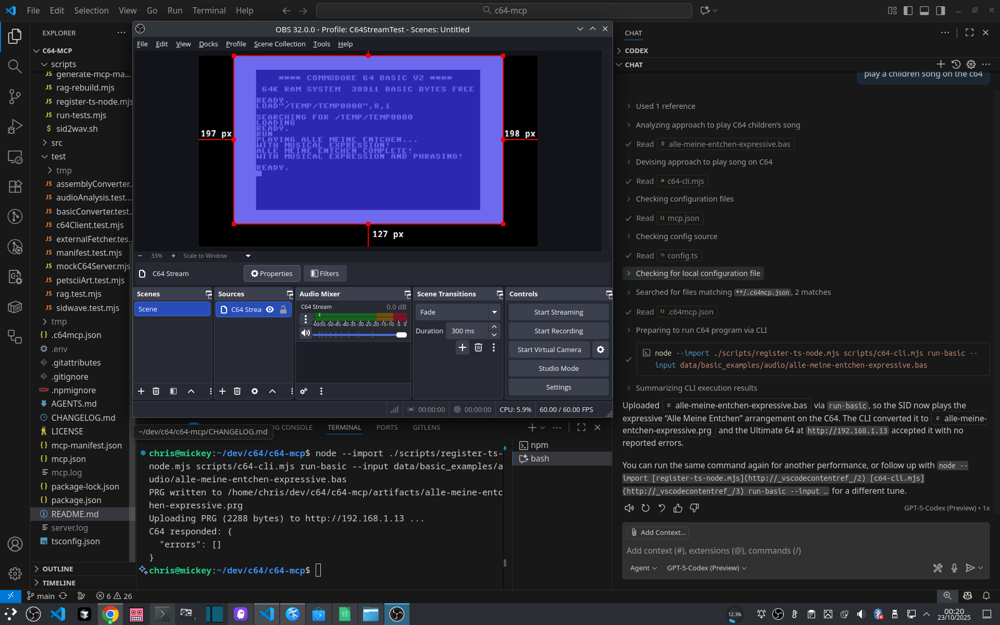
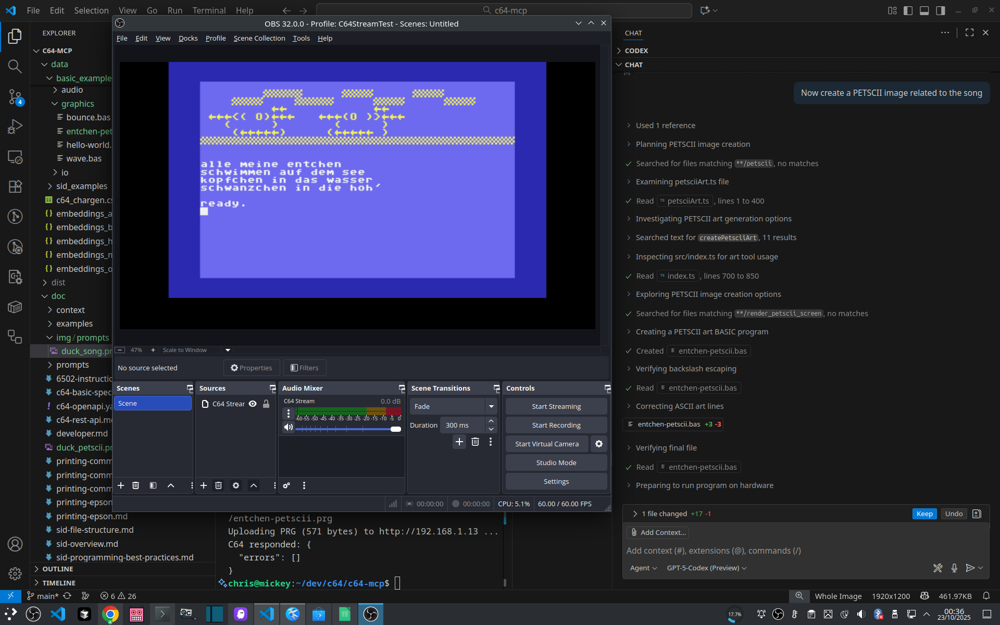
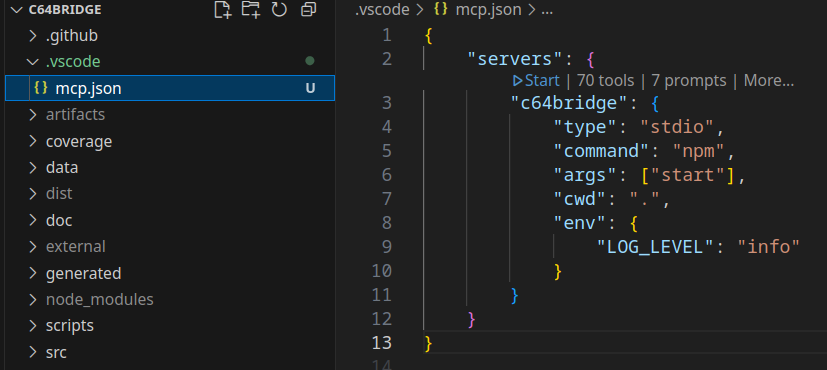
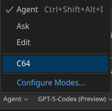
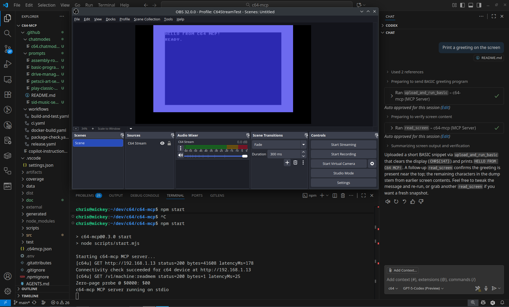

# C64 Bridge

Your AI Command Bridge for the Commodore 64.

[](https://www.npmjs.com/package/c64bridge)
[](https://github.com/chrisgleissner/c64bridge/actions/workflows/ci.yaml)
[](https://codecov.io/github/chrisgleissner/c64bridge)
[](https://www.gnu.org/licenses/old-licenses/gpl-2.0.en.html)
[](doc/developer.md)

## About

C64 Bridge is a Model Context Protocol ([MCP](https://modelcontextprotocol.io/docs/getting-started/intro)) server for driving a Commodore 64 with AI via the REST API of the [Commodore 64 Ultimate](https://www.commodore.net/) or [Ultimate 64](https://ultimate64.com/). It is built on the official TypeScript `@modelcontextprotocol/sdk` and communicates over the stdio transport.

Exposes tools and knowledge that enable [LLM agents](https://www.promptingguide.ai/research/llm-agents) to upload and run BASIC or assembly programs, read/write RAM, control the VIC or SID, print documents, and more.

## Features ✨

- **Code** in Basic or Assembly
- **Compose** music
- **Create** PETSCII drawings
- **Custom Knowledge Base** with built-in local Retrieval-Augmented Generation ([RAG](https://en.wikipedia.org/wiki/Retrieval-augmented_generation)) for prompt enrichment

## What is MCP?

The **Model Context Protocol (MCP)** defines a universal, secure, and consistent way for LLM-based applications to connect with external systems and data sources.  

Often called [*“the USB-C port for AI”*](https://docs.anthropic.com/en/docs/mcp), it provides a standardized interface that allows language models to access information and perform actions safely, predictably, and repeatably.

Although it resembles a traditional API, MCP is designed specifically for the way LLMs think and interact. An MCP server can:

- **Expose data** through **Resources** — structured information the model can draw into its working context.  
- **Provide functionality** through **Tools** — executable actions that perform tasks or cause effects.  
- **Offer guidance** through **Prompts** — reusable conversation patterns for complex operations.  

**C64 Bridge** applies this to the **Commodore 64**, serving as an **AI bridge and control deck**.  

You’re the Commodore at the helm — AI assists, extending the reach of your commands into the 8-bit world.

## Examples 🎬

Let's compose a children song on the C64 using ChatGPT and VS Code:

1. We type the prompt:
`play a children song on the c64`.
1. ChatGPT reads our prompt and creates a song. In this case it creates a Basic program that plays a song, but direct SID creation is work in progress.
1. The LLM then uses this MCP to transfer the Basic program to the Ultimate 64 and play it.

The following image shows the final output, using the [C64 Stream](https://github.com/chrisgleissner/c64stream/) OBS plugin to capture the C64 video and audio output:



1. After the follow-up prompt `Now create a PETSCII image related to that song` the following image of ducks swimming on a pond appears:



...and our C64 is now AI-powered!

## Installation 📦

The installation consists of two steps: Installing Node.js and then installing and running the MCP server.

### Install Node.js

Requires Node.js 18+ (20+ recommended) and npm.

- Linux (Ubuntu/Debian)

  ```bash
  sudo apt update
  sudo apt install -y curl ca-certificates
  # Option A: distro packages (may be older)
  sudo apt install -y nodejs npm
  # Option B (recommended): NodeSource LTS (20.x)
  curl -fsSL https://deb.nodesource.com/setup_20.x | sudo -E bash -
  sudo apt install -y nodejs
  ```

- macOS

  ```bash
  /bin/bash -c "$(curl -fsSL https://raw.githubusercontent.com/Homebrew/install/HEAD/install.sh)" # if Homebrew not installed
  brew install node@20
  brew link --overwrite node@20
  ```

- Windows

  ```powershell
  # Option A: winget (Windows 10/11)
  winget install OpenJS.NodeJS.LTS
  # Option B: Chocolatey
  choco install nodejs-lts -y
  ```

Verify:

```bash
node --version  # v18+ (v20+ recommended)

```

### Install and Run the MCP Server

You have three options to install and run the MCP server: quick start with npx, persistent install via npm, or install from source via GitHub if you want to run tests and contribute.

#### Quick start (npx, zero-setup)

Run the prebuilt server without creating a project. npx downloads the package and expands all bundled files on disk for this session.

```sh
npx -y c64bridge@latest
```

By default, the MCP server looks for `~/.c64bridge.json`. To target your device, create:

```json
{
  "c64u": {
    "host": "<hostname or IP>",
    "port": 80
  }
}
```

#### Persistent install (npm)

This installs the prebuilt `c64bridge` Node package from [npm](https://www.npmjs.com/package/c64bridge) and then runs the server. No build step required.

1. Create a folder (or use an existing project) and install the package:

```bash
mkdir -p ~/c64bridge && cd ~/c64bridge
npm init -y
npm install c64bridge
```

1. Configure your C64 target (optional but recommended):

Create `~/.c64bridge.json` with your device settings:

```json
{ "c64u": { "host": "c64u" } }
```

1. Start the server (stdio MCP):

```bash
node ./node_modules/c64bridge/dist/index.js
```

**Notes**

- Works fully offline. The npm package bundles `doc/`, `data/`, and `mcp.json`.
- All environment flags (e.g., `RAG_BUILD_ON_START=1`) apply the same as in a source checkout.
- Using npx or a local install both place the package contents on the filesystem in expanded form.

#### Install from source (GitHub)

Use this path if you plan to run tests or contribute code; `npm start` automatically prefers the TypeScript sources (via ts-node) when they are available and falls back to the compiled JavaScript otherwise.

1. Clone and install dependencies

```bash
git clone https://github.com/chrisgleissner/c64bridge.git
cd c64bridge
npm install
```

1. Start the development server

```bash
npm start
```

The dev server runs via ts-node; to build the compiled output, you can run:

```bash
npm run build
```

By default the server speaks MCP over stdio, which is the recommended mode for local editor integrations such as GitHub Copilot. If you need to expose the server to other machines, you can bridge it over HTTP with:

```bash
npm start -- --http [<port>]
```

Omitting the port uses `8000`. Only switch to HTTP when remote clients require it; stdio remains the preferred option because it avoids extra networking and keeps tool discovery automatic inside your editor.

### Setup GitHub Copilot in VS Code 💻

VS Code (version 1.102+) and GitHub Copilot Chat (version 1.214+) include native MCP support. To enable C64 Bridge integration:

#### Step 1: Enable MCP in Copilot Chat

- Open VS Code and ensure GitHub Copilot Chat extension is installed and signed in.
- Open **Settings** → **Extensions** → **GitHub Copilot** → **Chat: Experimental: MCP**.
- Enable the **MCP** checkbox.
- Restart VS Code.


#### Step 2: Start the MCP Server

Normally it gets started automatically, but if not, you can start it by opening `.vscode/mcp.json` in this repository and clicking on the "Start" icon:



It will log some `[warning]` messages which is normal since all logs by the MCP server go to `stderr`.

These are the expected logs in the Output panel of VS Studio when you select `MCP: c64bridge` from its drop-down:

```text
2025-10-27 18:50:01.811 [warning] [server stderr] Starting c64bridge MCP server...
2025-10-27 18:50:02.118 [warning] [server stderr] [tool] list tools count=70 bytes=89244 latencyMs=0
2025-10-27 18:50:02.118 [warning] [server stderr] [prompt] list prompts count=7 bytes=3196 latencyMs=0
2025-10-27 18:50:02.122 [info] Discovered 70 tools
2025-10-27 18:50:02.320 [warning] [server stderr] [c64u] GET http://192.168.1.64 status=200 bytes=41608 latencyMs=172
2025-10-27 18:50:02.320 [warning] [server stderr] Connectivity check succeeded for c64 device at http://192.168.1.64
```

Keep this running.

In case you are having difficulties to start C64 Bridge, please consult the official [VS Code MCP Server](https://code.visualstudio.com/docs/copilot/customization/mcp-servers) instructions.

#### Step 3: Activate the C64 Chat Mode

1. In VS Code, select **Menu → View → Chat** to open the Copilot Chat window.
1. At the bottom of that window, use the drop-down that lists `Agent`, `Ask`, `Edit`, and `C64`. The `C64` option should be auto-discovered from the `.github/chatmodes/c64.chatmode.md` file bundled with this project.
1. Select **C64** to switch into the dedicated chat mode, as shown below.



#### Step 4: Run Your First C64 AI Prompt

Prompt Copilot with **"Print a greeting on the screen"** to watch the MCP server upload and execute a BASIC greeting on your C64.

After a short while, a friendly AI greeting should appear on your C64 screen:



Well done! You are all set. 

## Documentation 📚

The following files provide further insight into various aspects of C64 Bridge:

- [`AGENTS.md`](AGENTS.md) — Quick-start guidance for automation agents and persona definitions.
- [`doc/MCP_SETUP.md`](doc/MCP_SETUP.md) — More details on MCP setup and integration with Visual Code.
- [`doc/developer.md`](doc/developer.md) — Development environment and workflow details. Also covers how to extend and rebuild the local RAG embeddings.
- [`doc/rest/c64-openapi.yaml`](doc/rest/c64-openapi.yaml) — OpenAPI 3.1 description of the REST surface.
- [`data/context/bootstrap.md`](data/context/bootstrap.md) — Core primer injected ahead of agent prompts.

## Configuration ⚙️

The MCP server reads its configuration from a JSON file called `.c64bridge.json` which is resolved as follows (first match wins):

1. explicit `C64BRIDGE_CONFIG` env var containing the absolute path to the config file
1. `~/.c64bridge.json` (from user home)
1. `./c64bridge.json` (from current working directory)

If no config file is found, it uses defaults: `host=c64u`, `port=80`

The configuration has a dedicated section for each supported platform (i.e. a real or software-emulated C64 device) as described in the chapters below.

### C64U (real hardware)

Use this section to point the server at an Commodore 64 Ultimate or Ultimate 64 device.

Provide the host (DNS name or IP, defaults to `c64u`) and a port (defaults to `80`).

```json
{
  "c64u": {
    "host": "c64u",
    "port": 80
  }
}
```

### VICE (software emulator)

> [!NOTE] This is an experimental feature that is currently very limited.

This backend starts a fresh [VICE](https://vice-emu.sourceforge.io/) process for each PRG run using the emulator binary. In phase one, memory/register operations are not supported; the focus is deterministic PRG execution.

```json
{
  "vice": {
    "exe": "/usr/bin/x64sc"
  }
}
```

Notes:

- If `vice.exe` is not set, the server attempts to find `x64sc` (or `x64`) on your `PATH`.
- Each program execution spawns a new VICE instance, e.g.:

  ```bash
  x64sc -autostart "program.prg" -silent -warp
  ```

### Backend selection rules

Backend selection is automatic with clear logging. The following precedence applies:

1. Explicit override: if `C64_MODE=c64u` or `C64_MODE=vice` is set in the environment, that backend is used.
2. Config presence: if only one of `c64u` or `vice` is configured, it is used.
3. Both configured: prefer `c64u` unless VICE is explicitly requested via `C64_MODE=vice`.
4. No configuration: probe the default C64U address (`http://c64u`); if unavailable, fall back to VICE.

On startup, the server logs the selected backend and reason, for example:

- `Active backend: c64u (from config)`
- `Active backend: vice (fallback – hardware unavailable)`

### Log Level

By default, the server logs info-level messages and above.

To enable debug logging, set the environment variable `LOG_LEVEL=debug` before starting the server.

In Visual Code, you can achieve this via an entry in your `.env` file at the project root:

```txt
LOG_LEVEL=debug
```

Please note that all logs use `stderr` since `stdout` is reserved for the MCP protocol messages.

## Build & Test 🧪

- `bun install` — install dependencies for development (fast path). Node users can continue to use `npm install`.
- `bun run build` — type-check the TypeScript sources, normalize the dist layout for packaging, and regenerate the MCP API tables in `README.md`.
- `npm test` — run the integration tests against an in-process mock that emulates the c64 REST API.
- `npm test -- --real` — exercise the same tests against a real c64 device. The runner reuses your MCP config (`~/.c64bridge.json` or `C64BRIDGE_CONFIG`) to determine the REST endpoint. You can also override explicitly with `--base-url=http://<host>`.
- `npm run check` — convenience command that runs both the type-check and the mock-backed test suite.
- `npm run coverage` — runs the Bun-powered test harness with coverage enabled and emits `coverage/lcov.info` (CI uploads to Codecov).

Notes:

- Built and tested with Bun for development speed; published package remains fully compatible with Node.js 18+.

The test runner accepts the following options:

- `--mock` (default): use the bundled mock hardware emulator.
- `--real`: talk to physical hardware (requires reachable C64 device).
- `--base-url=http://host[:port]`: override the REST endpoint when running with `--real`.

## MCP API Reference

<!-- AUTO-GENERATED:MCP-DOCS-START -->

### Tools

#### Programs
> Program uploaders, runners, and compilation workflows for BASIC, assembly, and PRG files.

**Workflow hints:**
- Choose BASIC or assembly uploaders based on the language you just generated for the user.
- Prefer PRG or CRT runners when the user supplies an Ultimate filesystem path instead of source text.

**Default tags:** `programs`, `execution`

| Name | Description | Tags |
| --- | --- | --- |
| `load_prg_file` | Load a PRG into C64 memory without executing it. | `programs`, `execution`, `file` |
| `run_crt_file` | Run a cartridge image stored on the Ultimate filesystem. | `programs`, `execution`, `cartridge` |
| `run_prg_file` | Run a PRG located on the Ultimate filesystem without uploading source. | `programs`, `execution`, `file` |
| `upload_and_run_asm` | Assemble 6502/6510 source code, upload the PRG, and run it immediately. See c64://specs/assembly. | `programs`, `execution`, `assembly` |
| `upload_and_run_basic` | Upload a BASIC program to the C64 and execute it immediately. Refer to c64://specs/basic for syntax and device I/O. | `programs`, `execution`, `basic` |

#### Memory
> Screen, main memory, and low-level inspection utilities.

**Workflow hints:**
- Pair memory operations with documentation snippets so addresses and symbols stay meaningful to the user.
- Confirm intent before mutating RAM and explain how the change affects the running program.

**Default tags:** `memory`, `debug`

| Name | Description | Tags |
| --- | --- | --- |
| `read_memory` | Read a range of bytes from main memory and return the data as hexadecimal. Consult c64://specs/assembly and docs index. | `memory`, `debug`, `hex` |
| `read_screen` | Read the current text screen (40x25) and return its ASCII representation. For PETSCII details, see c64://specs/basic. | `memory`, `debug`, `screen` |
| `write_memory` | Write a hexadecimal byte sequence into main memory at the specified address. See c64://context/bootstrap for safety rules. | `memory`, `debug`, `hex`, `write` |

#### Audio
> SID composition, playback, and audio analysis workflows.

**Workflow hints:**
- Reach for SID helpers when the user talks about sound design, playback quality, or stuck notes.
- After changing playback state, suggest verify-by-ear steps such as analyze_audio so the user gets concrete feedback.

**Default tags:** `sid`, `audio`

| Name | Description | Tags |
| --- | --- | --- |
| `analyze_audio` | Automatically analyze SID playback when the user requests verification feedback. | `sid`, `audio`, `analysis` |
| `modplay_file` | Play a MOD tracker module stored on the Ultimate filesystem. | `sid`, `audio`, `playback` |
| `music_compile_and_play` | Compile a SIDWAVE composition to PRG or SID and optionally play it immediately. | `sid`, `audio`, `music`, `compiler` |
| `music_generate` | Generate a lightweight arpeggio and schedule playback on SID voice 1. | `sid`, `audio`, `music`, `generator` |
| `record_and_analyze_audio` | Record audio from the default input device and analyze SID playback characteristics. | `sid`, `audio`, `analysis` |
| `sid_note_off` | Release a SID voice by clearing its GATE bit. | `sid`, `audio`, `control`, `music` |
| `sid_note_on` | Trigger a SID voice with configurable waveform, pulse width, and ADSR envelope. See c64://specs/sid. | `sid`, `audio`, `control`, `music` |
| `sid_reset` | Reset the SID chip either softly (silence) or with a full register scrub. | `sid`, `audio`, `control` |
| `sid_silence_all` | Silence all SID voices by clearing control and envelope registers. | `sid`, `audio`, `control` |
| `sid_volume` | Set the SID master volume register at $D418. See c64://specs/sid. | `sid`, `audio`, `control` |
| `sidplay_file` | Play a SID file stored on the Ultimate filesystem via the firmware player. | `sid`, `audio`, `playback` |

#### Machine
> Power, reset, pause/resume, and diagnostic controls for the C64 and Ultimate hardware.

**Workflow hints:**
- Reach for machine controls when the user mentions resets, power states, or DMA pause/resume.
- Explain the operational impact (e.g. soft reset vs firmware reboot) so the user knows what changed.

**Default tags:** `machine`, `control`

| Name | Description | Tags |
| --- | --- | --- |
| `menu_button` | Toggle the Ultimate 64 menu button. | `machine`, `control`, `menu` |
| `pause` | Pause the machine using DMA halt. See memory safety checklist in c64://context/bootstrap. | `machine`, `control`, `pause` |
| `poweroff` | Power off the machine via Ultimate firmware. See safety notes in c64://context/bootstrap. | `machine`, `control`, `power` |
| `reboot_c64` | Reboot the Ultimate firmware and C64. See c64://context/bootstrap. | `machine`, `control`, `reboot` |
| `reset_c64` | Reset the C64 via Ultimate firmware. Review c64://context/bootstrap safety rules. | `machine`, `control`, `reset` |
| `resume` | Resume the machine after a DMA pause. | `machine`, `control`, `resume` |

#### Storage
> Drive management, disk image creation, and file inspection utilities.

**Workflow hints:**
- Reach for storage tools when the user mentions drives, disk images, or Ultimate slots.
- Spell out which slot or path you touched so the user can replicate actions on hardware.

**Default tags:** `drive`, `storage`

| Name | Description | Tags |
| --- | --- | --- |
| `create_d64` | Create a blank D64 disk image on the Ultimate filesystem. | `drive`, `storage`, `disk`, `create` |
| `create_d71` | Create a blank D71 disk image on the Ultimate filesystem. | `drive`, `storage`, `disk`, `create` |
| `create_d81` | Create a blank D81 disk image on the Ultimate filesystem. | `drive`, `storage`, `disk`, `create` |
| `create_dnp` | Create a blank DNP disk image on the Ultimate filesystem. | `drive`, `storage`, `disk`, `create` |
| `drive_load_rom` | Temporarily load a custom ROM into an Ultimate drive slot. | `drive`, `storage`, `rom` |
| `drive_mode` | Set the emulation mode for an Ultimate drive slot (1541/1571/1581). | `drive`, `storage`, `mode` |
| `drive_mount` | Mount a disk image onto a specific Ultimate drive slot. | `drive`, `storage`, `mount` |
| `drive_off` | Power off a specific Ultimate drive slot. | `drive`, `storage`, `power` |
| `drive_on` | Power on a specific Ultimate drive slot. | `drive`, `storage`, `power` |
| `drive_remove` | Remove the currently mounted disk image from an Ultimate drive slot. | `drive`, `storage`, `unmount` |
| `drive_reset` | Reset the selected Ultimate drive slot. | `drive`, `storage`, `reset` |
| `drives_list` | List Ultimate drive slots and their currently mounted images. Read c64://context/bootstrap for drive safety. | `drive`, `storage`, `status` |
| `file_info` | Inspect metadata for a file on the Ultimate filesystem. | `drive`, `storage`, `info` |

#### Graphics
> PETSCII art, sprite workflows, and VIC-II graphics helpers.

**Workflow hints:**
- Suggest graphics helpers when the user asks for sprites, PETSCII art, or screen layout tweaks.
- Mention how VIC-II state changes (colours, sprite positions) affect follow-up memory operations.

**Default tags:** `graphics`, `vic`

| Name | Description | Tags |
| --- | --- | --- |
| `create_petscii_image` | Create PETSCII art from prompts or text, optionally run it on the C64, and return metadata. See c64://specs/basic and c64://specs/vic. | `graphics`, `vic`, `petscii`, `basic` |
| `generate_sprite_prg` | Generate and execute a PRG that displays a sprite from raw 63-byte data. See c64://specs/vic for registers. | `graphics`, `vic`, `sprite`, `assembly` |
| `render_petscii_screen` | Render PETSCII text to the screen with optional border/background colours. See c64://specs/basic. | `graphics`, `vic`, `basic`, `screen` |

#### Printer
> Printer workflow helpers for Commodore MPS and Epson FX devices, including prompt templates.

**Workflow hints:**
- Reach for printer tools when the user references device 4, hardcopy output, or specific printer models.
- Clarify which workflow (Commodore vs Epson) you chose so the user can prepare matching paper or ribbons.

**Default tags:** `printer`

| Name | Description | Tags |
| --- | --- | --- |
| `define_printer_chars` | Define custom characters on Commodore MPS printers using DLL mode. | `printer`, `dll`, `commodore` |
| `print_bitmap_commodore` | Print a Commodore MPS bit-image row using BIM BASIC helpers. | `printer`, `bitmap`, `commodore` |
| `print_bitmap_epson` | Print an Epson FX bit-image row using ESC/P commands. | `printer`, `bitmap`, `epson` |
| `print_text` | Print text on device 4 using Commodore or Epson workflows. See c64://docs/printer/guide. | `printer`, `text` |

#### Rag
> Retrieval-augmented generation helpers for BASIC and assembly examples.

**Workflow hints:**
- Call RAG tools when the user needs references or examples before generating new code.
- Summarise the number of refs returned and suggest follow-up actions like reading specific docs.

**Default tags:** `rag`, `search`

| Name | Description | Tags |
| --- | --- | --- |
| `rag_retrieve_asm` | Retrieve 6502/6510 assembly references from local knowledge. See c64://specs/assembly. | `rag`, `search`, `asm` |
| `rag_retrieve_basic` | Retrieve BASIC references from local knowledge. See c64://specs/basic before coding. | `rag`, `search`, `basic` |

#### Developer
> Configuration management, diagnostics, and helper utilities for advanced workflows.

**Workflow hints:**
- Use developer tools for firmware configuration, diagnostics, or advanced register tweaks.
- Call out any risky operations (like flash writes) so the user understands the impact.

**Default tags:** `developer`, `config`, `debug`

| Name | Description | Tags |
| --- | --- | --- |
| `config_batch_update` | Apply multiple configuration changes in a single request. | `developer`, `config`, `debug`, `write` |
| `config_get` | Read a configuration category or specific item. | `developer`, `config`, `debug`, `read` |
| `config_list` | List configuration categories available on the Ultimate firmware. | `developer`, `config`, `debug`, `list` |
| `config_load_from_flash` | Load configuration settings from flash storage. | `developer`, `config`, `debug`, `flash` |
| `config_reset_to_default` | Reset configuration categories to their factory defaults. | `developer`, `config`, `debug`, `reset` |
| `config_save_to_flash` | Persist current configuration settings to flash storage. | `developer`, `config`, `debug`, `flash` |
| `config_set` | Set a configuration value within a category. | `developer`, `config`, `debug`, `write` |
| `debugreg_read` | Read the Ultimate debug register ($D7FF). | `developer`, `config`, `debug` |
| `debugreg_write` | Write a value into the Ultimate debug register ($D7FF). | `developer`, `config`, `debug` |
| `info` | Retrieve Ultimate hardware information and status. | `developer`, `config`, `debug`, `diagnostics`, `info` |
| `version` | Retrieve Ultimate firmware and API version information. | `developer`, `config`, `debug`, `diagnostics`, `version` |

#### Streaming
> Long-running or streaming workflows such as audio capture or SID playback monitoring.

**Workflow hints:**
- Use streaming tools for long-running capture or monitoring workflows such as audio verification.
- Clarify that streams keep running until stopped so the user can manage resources.

**Default tags:** `stream`, `monitoring`

| Name | Description | Tags |
| --- | --- | --- |
| `stream_start` | Start an Ultimate streaming session (video/audio/debug) targeting a host:port destination. See c64://docs/index for usage notes. | `stream`, `monitoring`, `start` |
| `stream_stop` | Stop an Ultimate streaming session (video/audio/debug). | `stream`, `monitoring`, `stop` |

#### Meta
> High-level meta tools that orchestrate multiple MCP actions.

**Workflow hints:**
- Use meta tools to reduce round-trips by composing several steps into one.

**Default tags:** `meta`, `orchestration`, `experimental`

| Name | Description | Tags |
| --- | --- | --- |
| `batch_run_with_assertions` | Run multiple programs with post-condition assertions; produce junit-like results. | `meta`, `orchestration`, `experimental`, `testing`, `assertions` |
| `bundle_run_artifacts` | Gather screen capture, memory snapshots, and debugreg into a structured bundle for a run. | `meta`, `orchestration`, `experimental`, `artifacts`, `debugging` |
| `compile_run_verify_cycle` | Compile source (BASIC/ASM/SIDWAVE), run, verify via screen/audio, and archive artifacts. | `meta`, `orchestration`, `experimental`, `compile`, `verify` |
| `config_snapshot_and_restore` | Read all configuration categories and write a versioned snapshot, or restore from a snapshot; supports diff mode. | `meta`, `orchestration`, `experimental`, `config`, `snapshot` |
| `find_paths_by_name` | Return device paths whose names contain a substring; supports simple extension filters and wildcard-aware firmware search. | `meta`, `orchestration`, `experimental`, `files`, `discover` |
| `firmware_info_and_healthcheck` | Fetch firmware version and info, probe zero-page read, and return readiness with latencies. | `meta`, `orchestration`, `experimental`, `diagnostics` |
| `list_background_tasks` | List known background tasks and their status. | `meta`, `orchestration`, `experimental`, `background`, `scheduler` |
| `memory_dump_to_file` | Chunked memory dump with retries; optional pause/resume; writes hex or binary and a manifest. | `meta`, `orchestration`, `experimental`, `memory`, `dump`, `file` |
| `program_shuffle` | Discover and run PRG/CRT programs under a root path, capturing screens and resetting between runs. | `meta`, `orchestration`, `experimental`, `programs`, `testing` |
| `start_background_task` | Start a background task that runs an operation at a fixed interval for N iterations or indefinitely. | `meta`, `orchestration`, `experimental`, `background`, `scheduler` |
| `stop_all_background_tasks` | Stop all active background tasks. | `meta`, `orchestration`, `experimental`, `background`, `scheduler` |
| `stop_background_task` | Stop a named background task. | `meta`, `orchestration`, `experimental`, `background`, `scheduler` |
| `verify_and_write_memory` | Pause → read → verify (optional) → write → read-back → resume. Aborts on mismatch unless override. | `meta`, `orchestration`, `experimental`, `memory`, `write`, `verify` |
| `wait_for_screen_text` | Poll screen until a regex or substring matches, within a timeout. | `meta`, `orchestration`, `experimental`, `screen`, `assert` |

### Resources

| Name | Summary |
| --- | --- |
| `c64://docs/index` | Explains how to approach each knowledge bundle and when to consult it. |
| `c64://context/bootstrap` | Step-by-step rules for safe automation, verification, and rollback on the C64. |
| `c64://specs/basic` | Token definitions, syntax rules, and device I/O guidance for BASIC v2. |
| `c64://specs/assembly` | Official opcode matrix, addressing modes, and zero-page strategy for the 6510 CPU. |
| `c64://specs/sid` | Register map, waveform behaviour, and ADSR envelopes for expressive SID playback. |
| `c64://specs/sidwave` | Defines the SIDWAVE interchange format used by the SID composer workflow. |
| `c64://docs/sid/file-structure` | Explains PSID/RSID headers, metadata blocks, and compatibility notes for imported music. |
| `c64://docs/sid/best-practices` | Captures proven waveforms, ADSR presets, phrasing, and verification workflow for pleasant SID music. |
| `c64://specs/vic` | Covers raster timing, sprite control, colour RAM, and bitmap modes on the VIC-II. |
| `c64://specs/memory-map` | Page-by-page breakdown of the 64 KB address space with hardware, ROM, and RAM regions. |
| `c64://specs/memory-low` | Documents zero-page variables, BASIC pointers, and KERNAL workspace addresses. |
| `c64://specs/memory-kernal` | Lists KERNAL ROM vectors and service routines for OS-level functionality. |
| `c64://specs/io` | Covers VIC-II, SID, CIA, and system control registers with address ranges and usage notes. |
| `c64://specs/cia` | Details CIA 1/2 registers, timers, interrupts, and keyboard matrix layout. |
| `c64://specs/printer` | Covers device setup, control codes, and Ultimate 64 integration for printers. |
| `c64://docs/printer/guide` | Quick-look workflow covering setup, troubleshooting, and sample jobs for both printer families. |
| `c64://docs/printer/commodore-text` | Character sets, control codes, and formatting for Commodore MPS text output. |
| `c64://docs/printer/commodore-bitmap` | Details bitmap modes, graphics commands, and data layout for MPS bitmap printing. |
| `c64://docs/printer/epson-text` | Lists ESC/P control codes and formatting advice for Epson FX text output. |
| `c64://docs/printer/epson-bitmap` | Explains bit-image modes, density options, and data packing for Epson bitmap jobs. |
| `c64://docs/printer/prompts` | Reusable prompt templates that drive complex printer jobs through the MCP server. |

### Prompts

| Name | Description |
| --- | --- |
| `assembly-program` | Author 6502/6510 assembly routines with precise hardware guidance. |
| `basic-program` | Plan, implement, and verify Commodore BASIC v2 programs safely. |
| `drive-manager` | Mount, create, or power drives while preserving running workloads. |
| `graphics-demo` | Create VIC-II graphics demos with safe setup and validation steps. |
| `memory-debug` | Inspect or patch memory ranges with reversible steps and logging. |
| `printer-job` | Send formatted output to Commodore or Epson printers with safe teardown steps. |
| `sid-music` | Compose SID music with expressive phrasing and iterative audio verification. |

<!-- AUTO-GENERATED:MCP-DOCS-END -->

## Troubleshooting 🛟

If the MCP server is not reachable or VS Code integration isn't working, see the comprehensive troubleshooting guide:

**📋 [MCP Troubleshooting Guide](doc/troubleshooting-mcp.md)**

Quick diagnosis commands:

```bash
# Start stdio server
npm start
```
