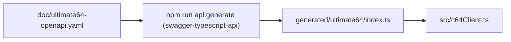

# Developer Guide

This document outlines how to work on the MCP server that bridges large language models with Ultimate 64 hardware.

## Project Layout

```
src/                Core server and client logic
  basicConverter.ts BASIC text → PRG encoder
  c64Client.ts      REST client for Ultimate 64
  config.ts         Configuration loader
  index.ts          Fastify MCP endpoint
doc/                Reference material and specs
scripts/            Utility CLI entry points (tests, etc.)
test/               Node test runner suites and helpers
```

Key documentation:
- `doc/c64-basic-spec.md` — BASIC tokenisation rules used by the converter.
- `doc/c64-rest-api.md` — Summary of the Ultimate 64 HTTP API.
- `doc/ultimate64-openapi.yaml` — Machine-readable API schema for mocking and generators.

## Prerequisites

- Node.js 20 (the repo uses ESM TypeScript executed through `ts-node`).
- npm for dependency management.
- Access to an Ultimate 64 (or a C64 compatible REST interface) if you intend to exercise real hardware.

## Setup

```bash
npm install
cp doc/examples/c64mcp.sample.json ~/.c64mcp.json # adjust host/IP as needed
```

You can override the configuration path with the `C64MCP_CONFIG` environment variable. If that file is absent, the runtime will look for the repository-level [`.c64mcp.json`](../.c64mcp.json) before falling back to `http://c64u`.

## Useful npm Scripts

| Command | Description |
| --- | --- |
| `npm start` | Launch the Fastify MCP server with ts-node. |
| `npm run build` | Type-check the TypeScript sources (no emit). |
| `npm test` | Run the Node test runner against the bundled mock Ultimate 64 server. |
| `npm test -- --real [--base-url=http://host]` | Execute the same suites against real hardware. The runner reuses the MCP config (`C64MCP_CONFIG`, `~/.c64mcp.json`, or repo `.c64mcp.json`) for the base URL, falling back to `http://c64u`. |
| `npm run check` | Convenience command that runs both the build step and the mock-backed tests. |
| `npm run c64:tool` | Launch an interactive helper to convert BASIC sources to PRG files, upload binaries, and run them on the Ultimate 64. |
| `npm run api:generate` | Regenerate the auto-generated REST client (`generated/ultimate64/index.ts`) from the OpenAPI spec. |

The test script is implemented in `scripts/run-tests.mjs`. It sets `C64_TEST_TARGET` for the suites and accepts the following flags:
- `--mock` (default) to use `test/mockC64Server.mjs`.
- `--real` to forward requests to real hardware.
- `--base-url` to override the REST endpoint when using `--real`.

## Architecture at a Glance

```mermaid
flowchart TD
    subgraph MCP Server (src/index.ts)
      Tools["HTTP endpoints /tools/*"]
      ClientFacade["C64Client facade (src/c64Client.ts)"]
    end

    subgraph Generated SDK (generated/ultimate64/)
      Api["Auto-generated REST client"]
    end

    Tools --> ClientFacade
    ClientFacade --> Api
    Api -->|HTTP| Ultimate["Ultimate 64 REST API"]

    ClientFacade --> BasicConverter["basicConverter.ts (BASIC → PRG)"]
    ClientFacade --> Config["config.ts (load C64 host/base URL)"]
```



## Testing Notes

- Node’s built-in test runner (`node --test`) is used for unit and integration coverage.
- `test/basicConverter.test.mjs` asserts byte-level PRG output.
- `test/c64Client.test.mjs` covers the REST client behaviour, including the mock server integration. Real hardware checks are skipped unless `--real` is provided.

## Fast Development Workflow

1. Run `npm run build` to ensure TypeScript types remain valid.
2. Use `npm test` to verify PRG encoding and REST interactions via the mock server.
3. When ready, execute `npm test -- --real` to confirm the server operates correctly against the actual Ultimate 64.
4. Update `doc/` when introducing new endpoints, tokens, or behaviour; keep `doc/ultimate64-openapi.yaml` in sync with the code.

## Retrieval-Augmented Knowledge

- The RAG subsystem (see `src/rag/*`) indexes `.bas`, `.asm`, `.s`, and reference Markdown files under `data/basic_examples/` and `data/assembly_examples/`. Dropping new examples or notes triggers a background re-index.
- External sources can be fetched on-demand from `src/rag/sources.csv` (columns: `type,description,link,depth`). The `depth` column is the number of transitive link levels from each seed; default 5 if omitted.
- Domain restriction: retrieval never leaves the registered domain of the seed URL (subdomains allowed). Cross-domain links are skipped and logged. Redirects are followed only if in-domain.
- Throttling & limits (configurable): default 10 requests/sec per host and max 500 requests per seed. Adaptive per-host limiter reduces RPS on 429/5xx and slowly recovers to the default. Retries use exponential backoff (default 3 attempts).
- Storage: fetched files are written to `external/` (gitignored) and included in the RAG indexing alongside `data/*`.
- Opt-in: builds/tests never perform network access. To fetch and update the index:

```bash
npm run rag:fetch
# Optional env overrides (tuning/limits):
#   RAG_SOURCES_CSV, RAG_EXTERNAL_DIR, RAG_DEFAULT_DEPTH,
#   RAG_RPS, RAG_MAX_REQUESTS, RAG_CONCURRENCY,
#   RAG_MAX_RETRIES, RAG_THROTTLE_FACTOR, RAG_RECOVERY_INTERVAL_MS, RAG_RECOVERY_STEP
```

Then rebuild embeddings (or wait for auto-reindexer):
```bash
npm run rag:rebuild
```

Logs are structured JSON lines including URL, depth, discoveries, throttling, retries, and a final session summary.
- `doc/6502-instructions.md` contains the condensed 6502/6510 quick reference served via the `asm_quick_reference` MCP tool and the `/rag/retrieve` helper when assembly or "fast program" keywords are present.
- When adding new knowledge artefacts, prefer Markdown with `##` headings so the search helpers in `src/knowledge.ts` can return focused sections.
- To force a full rebuild of the embedding indices (e.g., after large content changes), run `npm run rag:rebuild`. This regenerates `data/embeddings_basic.json` and `data/embeddings_asm.json` from the current files on disk.

## MCP Server Tips

- The server listens on port `8000` by default. Override with the `PORT` environment variable.
- Tool implementations live in `src/index.ts`. Additions should be reflected in `src/mcpManifest.json`.
- Keep REST interactions isolated in `src/c64Client.ts` so they can be mocked easily in tests.
