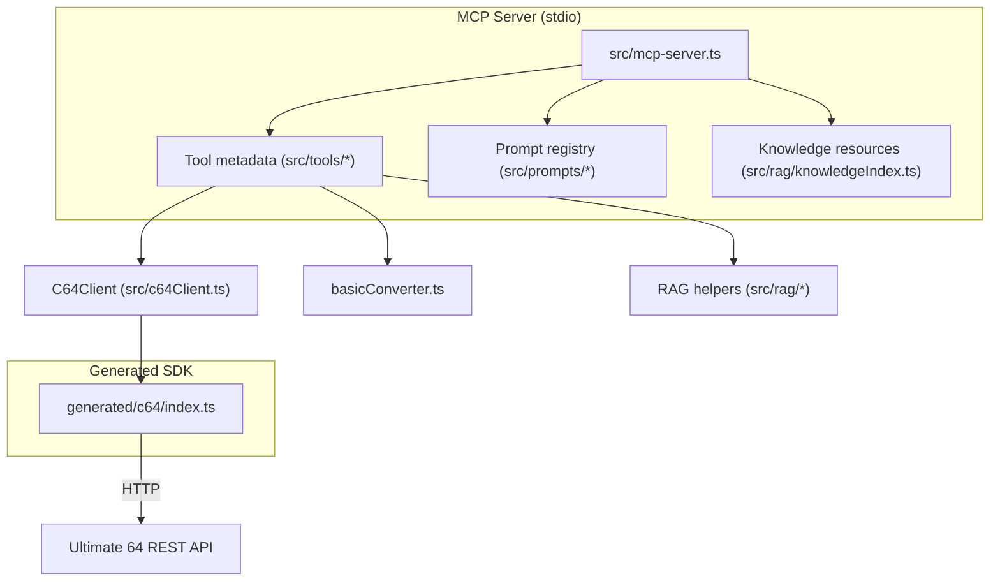
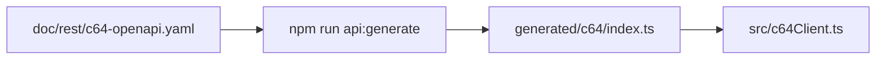

# Developer Guide

Concise reference for contributors working on the MCP server that bridges LLM workflows with Commodore 64 Ultimate hardware.

## Project Layout

- `src/` — core TypeScript sources for the MCP server.
  - `mcp-server.ts` wires tools, resources, and prompts into the stdio server entry point imported by `index.ts`.
  - Support modules such as `c64Client.ts`, `device.ts`, `viceRunner.ts`, `sidplayRunner.ts`, `loggingHttpClient.ts`, and `logger.ts` isolate hardware access and observability.
  - Domain folders include:
    - `audio/` for MCP-driven audio capture and analysis.
    - `rag/` for indexing, retrieval, and external source discovery.
    - `tools/` for individual MCP tool implementations plus decorators.
    - `prompts/` for authored prompt definitions surfaced to clients.
    - `types/` and `context.ts` for shared type definitions and session context helpers.
    - `petscii*.ts`, `basicConverter.ts`, `assemblyConverter.ts`, and `chargen.ts` for Commodore-specific encoders and assets.
    - `knowledge.ts` for resource wiring and `config.ts` for environment resolution.
- `scripts/` — Node/TypeScript utilities for starting the server, rebuilding docs, running tests, regenerating embeddings, packaging releases, and providing the CLI shim used by `c64-mcp`.
- `doc/` — documentation set (developer guide, REST references, troubleshooting, task notes).
- `data/` — knowledge corpus, embeddings, and example programs consumed by the RAG pipeline.
- `test/` — Node test suites plus mock server helpers; includes real-hardware toggles.
- `generated/` — OpenAPI-derived REST client (`npm run api:generate`).
- `scripts/cli.js` and `dist/` — compiled CLI façade and build artifacts produced by `npm run build` / npm packaging.
- `artifacts/` — gitignored output for PRG conversions, test embeddings, and other scratch products.
- `external/` — optional fetched corpora included in the RAG index.

Key documentation:

- `data/basic/basic-spec.md` — BASIC tokenisation rules used by the converter.
- `doc/rest/c64-rest-api.md` — Summary of the Ultimate REST API.
- `doc/rest/c64-openapi.yaml` — Machine-readable API schema for mocking and generators.
- `doc/tasks/use-mcp-sdk.md` — Step-by-step migration log with requirements.

## Prerequisites

- Node.js 18+ (20+ recommended); ESM TypeScript via `ts-node`.
- npm for dependency management.
- Optional: Ultimate 64 hardware (or compatible REST device) for real tests.

## Setup

```bash
npm install
```

Configuration resolution (first match wins):

1. Load the file referenced by `C64MCP_CONFIG` (when set); if unset, use `~/.c64mcp.json`.
2. If missing, fall back to `.c64mcp.json` at the repo root.
3. Otherwise, default to `host=c64u`, `port=80`.

`loadConfig()` normalises IPv6 literals, coerces legacy keys (`c64_host`, `c64_ip`), and caches the resolved structure for subsequent calls.

## Useful npm Scripts

**Core server flows**

- `npm start` launches the stdio MCP server with hot TypeScript support (`scripts/start.mjs`).
- `npm run mcp` runs the TypeScript entry point directly via `ts-node`; `npm run mcp:build` compiles to `dist/` first, then executes the bundled server for parity testing.
- `npm run build` compiles TypeScript, runs post-build normalization, and regenerates `README.md` tool/resource tables via `scripts/update-readme.ts`.
- `npm run lint` maps to `npm run check` for quick consistency with CI.

**Quality gates**

- `npm test` drives `scripts/run-tests.mjs` against the mock C64 server; pass `-- --real [--base-url=http://host]` to exercise actual hardware.
- `npm run check` executes `npm run build` followed by the mock test suite; `npm run coverage` wraps the same runner with c8.
- `npm run check:package` validates packaging metadata, while `npm run check:run-local` / `npm run check:run-npm` execute `scripts/run-mcp-check.sh` against local and packaged installs.

**RAG workflows**

- `npm run rag:rebuild` (alias `npm run build:rag`) rebuilds embeddings; `npm run rag:fetch` pulls external corpora declared in `src/rag/sources.csv`.
- `npm run rag:discover` performs experimental GitHub discovery using `src/rag/discover.ts` (requires credentials in `.env`).

**Tooling and release**

- `npm run c64:tool` opens the interactive helper for PRG conversion and upload; `npm run api:generate` refreshes the generated REST client.
- `npm run changelog:generate` distills Conventional Commit history, and `npm run release:prepare -- <semver>` orchestrates version bumps plus manifest regeneration.

Invoke `node --import ./scripts/register-ts-node.mjs scripts/update-readme.ts` directly when you need to refresh documentation tables without a full rebuild.

The test driver in `scripts/run-tests.mjs` accepts additional flags: `--mock` (default) to use `test/mockC64Server.mjs`, `--real` to target hardware (`C64_TEST_TARGET=real`), and `--base-url` to override the REST endpoint during real runs.

## MCP Architecture

The server is organised around three core surfaces exposed through the MCP SDK: **tools**, **resources**, and **prompts**. `src/mcp-server.ts` wires these registries together, loads configuration, and enforces platform compatibility.

```text
src/mcp-server.ts
├── toolRegistry (src/tools/registry.ts)
│    └── Domain modules (audio, graphics, memory, printer, rag, etc.)
├── knowledge resources (src/rag/knowledgeIndex.ts)
│    └── data/ and doc/ references surfaced via c64:// URIs
├── prompt registry (src/prompts/registry.ts)
│    └── Authored prompt definitions under .github/prompts and doc/prompts
└── platform awareness (src/platform.ts)
     └── Evaluates backend compatibility (C64U vs VICE) for each tool
```

`scripts/start.mjs` detects whether TypeScript sources are available and launches `src/mcp-server.ts` (via `src/index.ts`), ensuring both local development and packaged CLI usage share the same entry point.





## MCP Server Tips

- Preferred transport is stdio (`src/mcp-server.ts`); `src/index.ts` simply imports this module so CLI and npm consumers share the same entry point.
- The legacy Fastify HTTP server now lives in `src/http-server.ts.backup`. Keep it untouched unless you need to resurrect HTTP compatibility for debugging.
- MCP tools enforce platform compatibility via `src/platform.ts`; run `npm test` to cover both metadata and runtime enforcement.
- Keep REST interactions isolated in `src/c64Client.ts` for easy mocking.

## Testing Notes

- Node’s built-in test runner (`node --test`) is wrapped by `scripts/run-tests.mjs`.
- Use `npm run coverage` (c8) to capture coverage without double-running tests.
- `test/basicConverter.test.mjs`: byte-level PRG output validation.
- `test/c64Client.test.mjs`: REST client and mock-server integration; `--real` toggles hardware.
- `test/suites/mcpServer*.mjs`: End-to-end MCP surface coverage (tools, resources, prompts).

## Fast Development Workflow

1. `npm run build` to validate types.
2. `npm test` against the mock server.
3. `npm test -- --real` when hardware is available.
4. Update `doc/` and keep `doc/rest/c64-openapi.yaml` in sync with code.

## Release Workflow

1. Create a short-lived branch (for example `release/X.Y.Z`) from the target commit.
2. Run `npm run release:prepare -- <semver>` to bump versions (`major`, `minor`, `patch`, or explicit like `0.2.0`). This updates `package.json`, `package-lock.json`, `mcp.json`, and prepends a new section to `CHANGELOG.md` from commit messages since the last tag.
3. Review and commit the changes, then open a pull request.
4. After the PR merges, create and push the tag (`git tag X.Y.Z && git push origin X.Y.Z`) or use the GitHub release UI; CI will now see matching versions.
5. Perform the publish/release steps that rely on the tag (npm publish, GitHub release, etc.).

### Commit Messages and CHANGELOG Generation

This repository uses a light [Conventional Commits](https://www.conventionalcommits.org) style to generate [`CHANGELOG.md`](https://github.com/chrisgleissner/c64-mcp/blob/main/CHANGELOG.md) entries (aligned with [Keep a Changelog](https://keepachangelog.com/)) during `release:prepare`:

- Format: `type(scope)?: subject`.
- Examples:
  - `feat: add SID triangle-wave example`
  - `fix(petscii): correct chargen mapping for inverted glyphs`
  - `docs: clarify health checks (/health vs /tools/version)`
  - `refactor: extract audio analyzer helpers`
  - `perf: speed up RAG embedding load`
  - `chore(ci): pin setup-node to v4`
- Breaking changes: add a `!` after the type, e.g., `feat!: remove deprecated /tools/info fallback`.

During a release prep, the script groups commits since the previous tag into sections:

- Features (`feat`)
- Bug Fixes (`fix`)
- Performance (`perf`)
- Refactoring (`refactor`)
- Documentation (`docs`)
- Tests (`test`)
- Chores (`build`, `ci`, `chore`)
- Other (non-conforming subjects)

Tips:

- Prefer concise subjects; the changelog lists the subject plus the short SHA.
- Skip “Merge …” subjects; they are filtered automatically.
- Run `npm run changelog:generate` to regenerate locally; it prepends a new section for the current `package.json` version using commits since the last tag.


## Local RAG

### Overview

- The retrieval-augmented generation subsystem ingests C64-related BASIC, assembly, and Markdown files under `data/` plus a curated subset of docs.
- Embeddings are written as deterministic JSON payloads (`embeddings_*.json`) inside `data/` unless you override the target with `RAG_EMBEDDINGS_DIR`.
- The server consumes these indices at startup to enrich MCP tool prompts; if indices are missing it simply serves empty results until you build them.

### Indexed Content

- Drop additional snippets, notes, or source code anywhere under `data/` and the indexer will pick them up recursively.
- Include documentation that lives outside `data/` by exporting `RAG_DOC_FILES=path/to/doc1.md,path/to/doc2.md` before rebuilding; the defaults already cover `data/assembly/assembly-spec.md`.

### Configuration Flags

- `RAG_EMBEDDINGS_DIR`: relocate the generated JSON files (the test suite points this at `artifacts/test-embeddings`).
- `RAG_REINDEX_INTERVAL_MS`: set to `0` (default) to disable background polling; raise it to opt into periodic rebuilds.
- `RAG_BUILD_ON_START`: unset by default so the server reuses existing indices; set to `1` for a one-time rebuild during startup.

The indexer only touches files when content changes to avoid noisy diffs.

### Maintenance Commands

- `npm run rag:rebuild` — rebuild embeddings immediately.
- `npm run rag:fetch` — refresh external source material defined in `src/rag/sources.csv` before rebuilding.

### Using the Retriever

- Tools: call `rag_retrieve_basic` or `rag_retrieve_asm` over the MCP stdio session with `{ "q": "query", "k": 3 }` to pull BASIC or assembly references.
- Optional HTTP probe: only if you manually launch the legacy Fastify server (see "Optional HTTP Compatibility" in `doc/troubleshooting-mcp.md`), you can `GET /rag/retrieve?q=<text>&k=3&lang=basic|asm` for quick inspection.

```bash
# Example legacy probe once the optional HTTP server is running
curl -s "http://localhost:8000/rag/retrieve?q=draw%20a%20sine%20wave&k=3&lang=basic" | jq
```

### Index Hygiene

- Keep `RAG_REINDEX_INTERVAL_MS=0` in CI and local development unless you are actively modifying the corpus.
- Run `npm run rag:rebuild` after significant documentation imports so teammates receive the updated indices in version control.
- When experimentation requires rapid iteration, point `RAG_EMBEDDINGS_DIR` at a temporary folder and skip committing the generated files.

### External Sources

Extending the RAG from external sources is a three-step process: discover sources, fetch content from them, and add the content to the index.

#### Discover

> [!NOTE]
> This feature is experimental.

To discover new C64 sources on GitHub, first create a `.env` file with GitHub credentials with these contents:

```env
GITHUB_TOKEN=<personalAccessToken>
```

The `<personalAccessToken>` can be issued at [GitHub Personal Access Tokens](https://github.com/settings/personal-access-tokens) with these values:

- Expiration: 90 days
- Resource owner: Your GitHub user account
- Repository access: All repositories
- Access type: Public repositories
- Permissions: Metadata (Read-only), Contents (Read-only)

Then run:

```bash
npm install --save-dev dotenv-cli
npx dotenv -e .env -- npm run rag:discover
```

This will extend the file `src/rag/sources.csv`.

#### Fetch

To download sources available at locations defined in `src/rag/sources.csv`:

1. (Optional) Extend `src/rag/sources.csv` (columns: `type,description,link,depth`) with new sources.
1. Fetch sources (opt-in, no network on builds/tests):

   ```bash
   npm run rag:fetch
   ```

#### Rebuild

1. Rebuild the RAG index to incorporate new or changed sources:

   ```bash
   # either rely on the running server's auto-reindexer (default ~15s), or
   npm run rag:rebuild
   ```

#### Notes

- Downloads are stored under `external/` (gitignored) and included in the index alongside `data/*`.
- If you delete files from `external/` and rebuild, their content will be removed from the RAG. To “freeze” current embeddings, avoid rebuilding (e.g., set `RAG_REINDEX_INTERVAL_MS=0`) until you want to refresh.

For advanced options (depth semantics, throttling/limits, adaptive rate limiting, retries, logs, and environment overrides), see the dedicated section in `doc/developer.md`.

## Utility Scripts 🛠️

- `npm run c64:tool` — interactive helper that can:
  - convert a BASIC file to a PRG and store it under `artifacts/` (or a path you choose),
  - convert and immediately run the generated PRG on the configured c64 device,
  - upload an existing PRG and run it on the c64 device.
- `npm run api:generate` — regenerate the typed REST client under `generated/c64/` from [`doc/rest/c64-openapi.yaml`](doc/rest/c64-openapi.yaml).
- Advanced users can call the underlying CLI directly:

  ```bash
  node --import ./scripts/register-ts-node.mjs scripts/c64-cli.mjs convert-basic --input path/to/program.bas
  node --import ./scripts/register-ts-node.mjs scripts/c64-cli.mjs run-basic --input path/to/program.bas
  node --import ./scripts/register-ts-node.mjs scripts/c64-cli.mjs run-prg --input artifacts/program.prg
  ```

Generated binaries are written to the `artifacts/` directory by default (ignored by git) so you can transfer them to real hardware or flash media. Make sure your `~/.c64mcp.json` (or `C64MCP_CONFIG`) points at your c64 device before using the run options.
