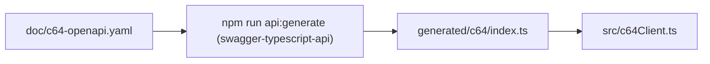

# Developer Guide

Concise reference for contributors working on the MCP server bridging LLMs with C64 Ultimate hardware.

## Project Layout

```
src/                Core server and client logic
  basicConverter.ts BASIC text → PRG encoder
  c64Client.ts      REST client for c64 devices
  config.ts         Configuration loader
  index.ts          Fastify MCP endpoint
doc/                Reference material and specs
scripts/            Utility CLI entry points (tests, etc.)
test/               Node test runner suites and helpers
```

Key documentation:
- `doc/c64-basic-spec.md` — BASIC tokenisation rules used by the converter.
- `doc/c64-rest-api.md` — Summary of the c64 REST API.
- `doc/c64-openapi.yaml` — Machine-readable API schema for mocking and generators.

## Prerequisites

- Node.js 18+ (20+ recommended); ESM TypeScript via `ts-node`.
- npm for dependency management.
- Optional: Ultimate 64 hardware (or compatible REST device) for real tests.

## Setup

```bash
npm install
cp doc/examples/c64mcp.sample.json ~/.c64mcp.json # adjust host/IP
```

You can override the configuration path with `C64MCP_CONFIG`. If the file is absent, the runtime looks for the repository-level [`.c64mcp.json`](../.c64mcp.json) before falling back to `http://c64u`.

## Useful npm Scripts

- `npm start`: Launch the Fastify MCP server with ts-node.
- `npm run build`: Type-check TypeScript sources (no emit).
- `npm test`: Run tests against the bundled mock server.
- `npm test -- --real [--base-url=http://host]`: Run against hardware.
- `npm run check`: Build + mock tests.
- `npm run c64:tool`: Interactive BASIC/PRG helper.
- `npm run api:generate`: Regenerate the REST client (`generated/c64/index.ts`).

The test script is implemented in `scripts/run-tests.mjs`. It sets `C64_TEST_TARGET` for the suites and accepts the following flags:
- `--mock` (default) to use `test/mockC64Server.mjs`.
- `--real` to forward requests to real hardware.
- `--base-url` to override the REST endpoint when using `--real`.

## Architecture at a Glance

```mermaid
flowchart TD
    subgraph MCP Server (src/index.ts)
      Tools["HTTP endpoints /tools/*"]
      ClientFacade["C64Client facade (src/c64Client.ts)"]
    end

    subgraph Generated SDK (generated/c64/)
    Api["Auto-generated REST client"]
    end

    Tools --> ClientFacade
    ClientFacade --> Api
    Api -->|HTTP| C64API["c64 REST API"]

    ClientFacade --> BasicConverter["basicConverter.ts (BASIC → PRG)"]
    ClientFacade --> Config["config.ts (load C64 host/base URL)"]
```



## Testing Notes

- Node’s built-in test runner (`node --test`) provides coverage.
- `test/basicConverter.test.mjs`: byte-level PRG output.
- `test/c64Client.test.mjs`: REST client and mock-server integration; `--real` toggles hardware.

## Fast Development Workflow

1. `npm run build` to validate types.
2. `npm test` with mock server.
3. `npm test -- --real` for hardware.
4. Update `doc/` and keep `doc/c64-openapi.yaml` in sync with code.

## Retrieval-Augmented Knowledge

- RAG subsystem (`src/rag/*`) indexes `.bas`, `.asm`, `.s`, and Markdown files under `data/*`. Changes trigger a background re-index.
- External sources: edit `src/rag/sources.csv` (`type,description,link,depth`), then:

```bash
npm run rag:fetch
npm run rag:rebuild  # or rely on auto-reindex (~15s default)
```

- Defaults: in-domain only; adaptive rate limiting; no network during build/test.
- See `doc/6502-instructions.md` for the assembly quick reference surfaced by `asm_quick_reference` and `/rag/retrieve`.

## MCP Server Tips

- Default port `8000` (override with `PORT`).
- Tool implementations live in `src/index.ts`; mirror changes in `src/mcpManifest.json`.
- Keep REST interactions isolated in `src/c64Client.ts` for easy mocking.
