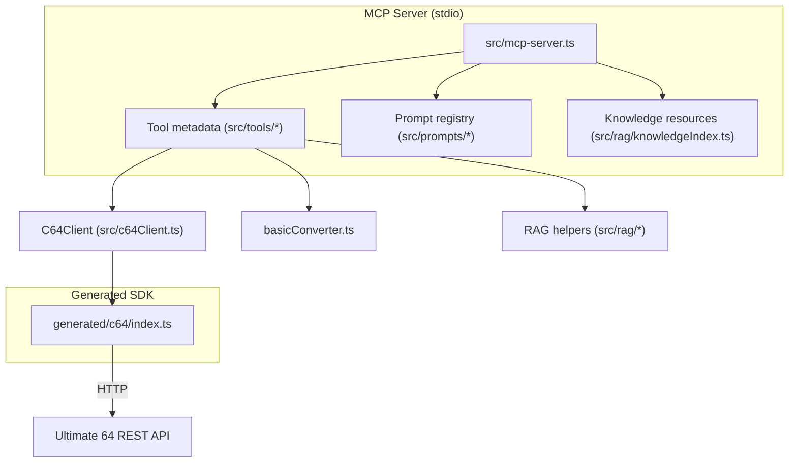
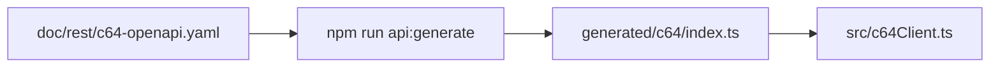

# Developer Guide

Concise reference for contributors working on the MCP server that bridges LLM workflows with Commodore 64 Ultimate hardware.

## Project Layout

```text
src/                    Core MCP implementation
  mcp-server.ts         Primary MCP stdio server wiring tools/resources/prompts
  index.ts              Thin wrapper used by CLI entry point (imports mcp-server)
  http-server.ts.backup Archived Fastify HTTP surface kept for reference only
  tools/                Domain modules (program runners, audio, graphics, etc.)
  prompts/              Prompt registry and authored prompt definitions
  rag/                  Retrieval-augmented generation helpers and pipeline
  c64Client.ts          REST client for Ultimate 64 / C64 Ultimate hardware
  basicConverter.ts     BASIC text → PRG encoder used across tools/tests
  platform.ts           Backend capability detection shared by tools
  petsciiArt.ts         PETSCII renderer used by graphics tools
  sidwave*.ts           SID music compiler and helpers
  assemblyConverter.ts  6502 assembler for program loaders
scripts/                Utility CLI entry points (tests, packaging, release)
doc/                    Reference material and specs
test/                   Node test runner suites and helpers (mock + real targets)
```

Key documentation:

- `data/basic/basic-spec.md` — BASIC tokenisation rules used by the converter.
- `doc/rest/c64-rest-api.md` — Summary of the Ultimate REST API.
- `doc/rest/c64-openapi.yaml` — Machine-readable API schema for mocking and generators.
- `doc/tasks/use-mcp-sdk.md` — Step-by-step migration log with requirements.

## Prerequisites

- Node.js 18+ (20+ recommended); ESM TypeScript via `ts-node`.
- npm for dependency management.
- Optional: Ultimate 64 hardware (or compatible REST device) for real tests.

## Setup

```bash
npm install
```

Configuration resolution (first match wins):

1. Load the file referenced by `C64MCP_CONFIG` (when set); if unset, use `~/.c64mcp.json`.
2. If missing, fall back to `.c64mcp.json` at the repo root.
3. Otherwise, default to `host=c64u`, `port=80` (`baseUrl` derived automatically).

`loadConfig()` normalises IPv6 literals, coerces legacy keys (`c64_host`, `c64_ip`, `baseUrl`), and caches the resolved structure for subsequent calls.

## Useful npm Scripts

- `npm start`: Launch the MCP SDK stdio server (preferred). Falls back to compiled JS when ts-node is unavailable.
- `npm run build`: Type-check TypeScript sources and normalise the `dist/` output.
- `npm test`: Run tests against the bundled mock server.
- `npm test -- --real [--base-url=http://host]`: Run the suite against real hardware.
- `npm run check`: Perform a build and run the mock test suite.
- `npm run c64:tool`: Launch the interactive BASIC/PRG helper utilities.
- `npm run api:generate`: Regenerate the REST client (`generated/c64/index.ts`).
- `npm run rag:rebuild`: Rebuild embeddings and the RAG index when data changes.
- `npm run release:prepare -- <semver>`: Bump versions, regenerate manifest, and stage changelog updates.

The build pipeline finishes by running `scripts/update-readme.ts`, which introspects the MCP registries and rewrites the `README.md` reference tables. Invoke it directly (`node --import ./scripts/register-ts-node.mjs scripts/update-readme.ts`) after changing tools, resources, or prompts to refresh the docs without a full rebuild.

The test driver in `scripts/run-tests.mjs` accepts additional flags:

- `--mock` (default) to use `test/mockC64Server.mjs`.
- `--real` to forward requests to hardware (`C64_TEST_TARGET=real`).
- `--base-url` to override the REST endpoint while using `--real`.

## MCP Architecture

The server is organised around three core surfaces exposed through the MCP SDK: **tools**, **resources**, and **prompts**. `src/mcp-server.ts` wires these registries together, loads configuration, and enforces platform compatibility.

```text
src/mcp-server.ts
├── toolRegistry (src/tools/registry.ts)
│    └── Domain modules (audio, graphics, memory, printer, rag, etc.)
├── knowledge resources (src/rag/knowledgeIndex.ts)
│    └── data/ and doc/ references surfaced via c64:// URIs
├── prompt registry (src/prompts/registry.ts)
│    └── Authored prompt definitions under .github/prompts and doc/prompts
└── platform awareness (src/platform.ts)
     └── Evaluates backend compatibility (C64U vs VICE) for each tool
```

`scripts/start.mjs` detects whether TypeScript sources are available and launches `src/mcp-server.ts` (via `src/index.ts`), ensuring both local development and packaged CLI usage share the same entry point.





## MCP Server Tips

- Preferred transport is stdio (`src/mcp-server.ts`); `src/index.ts` simply imports this module so CLI and npm consumers share the same entry point.
- The legacy Fastify HTTP server now lives in `src/http-server.ts.backup`. Keep it untouched unless you need to resurrect HTTP compatibility for debugging.
- MCP tools enforce platform compatibility via `src/platform.ts`; run `npm test` to cover both metadata and runtime enforcement.
- Keep REST interactions isolated in `src/c64Client.ts` for easy mocking.

## Testing Notes

- Node’s built-in test runner (`node --test`) is wrapped by `scripts/run-tests.mjs`.
- Use `npm run coverage` (c8) to capture coverage without double-running tests.
- `test/basicConverter.test.mjs`: byte-level PRG output validation.
- `test/c64Client.test.mjs`: REST client and mock-server integration; `--real` toggles hardware.
- `test/suites/mcpServer*.mjs`: End-to-end MCP surface coverage (tools, resources, prompts).

## Fast Development Workflow

1. `npm run build` to validate types.
2. `npm test` against the mock server.
3. `npm test -- --real` when hardware is available.
4. Update `doc/` and keep `doc/rest/c64-openapi.yaml` in sync with code.

## Release Workflow

1. Create a short-lived branch (for example `release/X.Y.Z`) from the target commit.
2. Run `npm run release:prepare -- <semver>` to bump versions (`major`, `minor`, `patch`, or explicit like `0.2.0`). This updates `package.json`, `package-lock.json`, `mcp.json`, and prepends a new section to `CHANGELOG.md` from commit messages since the last tag.
3. Review and commit the changes, then open a pull request.
4. After the PR merges, create and push the tag (`git tag X.Y.Z && git push origin X.Y.Z`) or use the GitHub release UI; CI will now see matching versions.
5. Perform the publish/release steps that rely on the tag (npm publish, GitHub release, etc.).

### Commit Messages and CHANGELOG Generation

This repository uses a light [Conventional Commits](https://www.conventionalcommits.org) style to generate [`CHANGELOG.md`](https://github.com/chrisgleissner/c64-mcp/blob/main/CHANGELOG.md) entries (aligned with [Keep a Changelog](https://keepachangelog.com/)) during `release:prepare`:

- Format: `type(scope)?: subject`.
- Examples:
  - `feat: add SID triangle-wave example`
  - `fix(petscii): correct chargen mapping for inverted glyphs`
  - `docs: clarify health checks (/health vs /tools/version)`
  - `refactor: extract audio analyzer helpers`
  - `perf: speed up RAG embedding load`
  - `chore(ci): pin setup-node to v4`
- Breaking changes: add a `!` after the type, e.g., `feat!: remove deprecated /tools/info fallback`.

During a release prep, the script groups commits since the previous tag into sections:

- Features (`feat`)
- Bug Fixes (`fix`)
- Performance (`perf`)
- Refactoring (`refactor`)
- Documentation (`docs`)
- Tests (`test`)
- Chores (`build`, `ci`, `chore`)
- Other (non-conforming subjects)

Tips:

- Prefer concise subjects; the changelog lists the subject plus the short SHA.
- Skip “Merge …” subjects; they are filtered automatically.
- Run `npm run changelog:generate` to regenerate locally; it prepends a new section for the current `package.json` version using commits since the last tag.

## Retrieval-Augmented Knowledge

- RAG subsystem (`src/rag/*`) indexes `.bas`, `.asm`, `.s`, and Markdown files under `data/*`. Changes trigger a background re-index.
- Selected docs under `doc/` are also indexed (default: `data/assembly/assembly-spec.md`). Extend the set by exporting `RAG_DOC_FILES=path/to/doc1.md,path/to/doc2.md` before a rebuild.
- Set `RAG_EMBEDDINGS_DIR` to redirect the generated `embeddings_basic.json` / `embeddings_asm.json` files to another directory (the test runner uses `artifacts/test-embeddings` to avoid touching tracked files).
- External sources: edit `src/rag/sources.csv` (`type,description,link,depth`), then:

```bash
npm run rag:fetch
npm run rag:rebuild  # or rely on auto-reindex (~15s default)
```

- Defaults: in-domain only; adaptive rate limiting; no network during build/test.
- See `data/assembly/assembly-spec.md` for the assembly quick reference surfaced by `assembly_spec` and `/rag/retrieve`.
