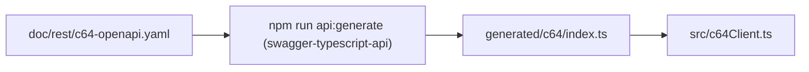

# Developer Guide

Concise reference for contributors working on the MCP server bridging LLMs with C64 Ultimate hardware.

## Project Layout

```
src/                Core server and client logic
  basicConverter.ts BASIC text → PRG encoder
  c64Client.ts      REST client for c64 devices
  config.ts         Configuration loader
  index.ts          Fastify MCP endpoint
doc/                Reference material and specs
scripts/            Utility CLI entry points (tests, etc.)
test/               Node test runner suites and helpers
```

Key documentation:
- `data/basic/basic-spec.md` — BASIC tokenisation rules used by the converter.
- `doc/rest/c64-rest-api.md` — Summary of the c64 REST API.
- `doc/rest/c64-openapi.yaml` — Machine-readable API schema for mocking and generators.

## Prerequisites

- Node.js 18+ (20+ recommended); ESM TypeScript via `ts-node`.
- npm for dependency management.
- Optional: Ultimate 64 hardware (or compatible REST device) for real tests.

## Setup

```bash
npm install
```

Configuration resolution, first match wins:

1. Load from path in `C64MCP_CONFIG` env var
2. Load from `.c64mcp.json` in current working directory
3. Load from `.c64mcp.json` in user home
4. Use defaults: `HOST=c64u`, `PORT=80`

## Useful npm Scripts

- `npm start`: Launch the Fastify MCP server with ts-node.
- `npm run build`: Type-check TypeScript sources and generate `mcp-manifest.json`.
- `npm test`: Run tests against the bundled mock server.
- `npm test -- --real [--base-url=http://host]`: Run against hardware.
- `npm run check`: Build + mock tests.
- `npm run c64:tool`: Interactive BASIC/PRG helper.
- `npm run api:generate`: Regenerate the REST client (`generated/c64/index.ts`).

The test script is implemented in `scripts/run-tests.mjs`. It sets `C64_TEST_TARGET` for the suites and accepts the following flags:
- `--mock` (default) to use `test/mockC64Server.mjs`.
- `--real` to forward requests to real hardware.
- `--base-url` to override the REST endpoint when using `--real`.

## Architecture at a Glance

```mermaid
flowchart TD
    subgraph MCP Server (src/index.ts)
      Tools["HTTP endpoints /tools/*"]
      ClientFacade["C64Client facade (src/c64Client.ts)"]
    end

    subgraph Generated SDK (generated/c64/)
    Api["Auto-generated REST client"]
    end

    Tools --> ClientFacade
    ClientFacade --> Api
    Api -->|HTTP| C64API["c64 REST API"]

    ClientFacade --> BasicConverter["basicConverter.ts (BASIC → PRG)"]
    ClientFacade --> Config["config.ts (load C64 host/base URL)"]
```



## Testing Notes

- Node’s built-in test runner (`node --test`) provides coverage.
- `test/basicConverter.test.mjs`: byte-level PRG output.
- `test/c64Client.test.mjs`: REST client and mock-server integration; `--real` toggles hardware.

## Fast Development Workflow

1. `npm run build` to validate types.
2. `npm test` with mock server.
3. `npm test -- --real` for hardware.
4. Update `doc/` and keep `doc/rest/c64-openapi.yaml` in sync with code.

## Release Workflow

1. Create a short-lived branch (for example `release/X.Y.Z`) from the target commit.
2. Run `npm run release:prepare -- <semver>` to bump versions (`major`, `minor`, `patch`, or explicit like `0.2.0`). This updates `package.json`, `package-lock.json`, `mcp.json`, regenerates `mcp-manifest.json`, and prepends a new section to `CHANGELOG.md` from commit messages since the last tag.
3. Review and commit the changes, then open a pull request.
4. After the PR merges, create and push the tag (`git tag X.Y.Z && git push origin X.Y.Z`) or use the GitHub release UI; CI will now see matching versions.
5. Perform the publish/release steps that rely on the tag (npm publish, GitHub release, etc.).

### Commit Messages and CHANGELOG Generation

This repository uses a light [Conventional Commits](https://www.conventionalcommits.org) style to generate a [`CHANGELOG.md`](https://github.com/chrisgleissner/c64-mcp/blob/main/CHANGELOG.md) (in line with [Keep a Changelog](https://keepachangelog.com/) principles) automatically during `release:prepare`:

- Format: `type(scope)?: subject`
- Examples:
  - `feat: add SID triangle-wave example`
  - `fix(petscii): correct chargen mapping for inverted glyphs`
  - `docs: clarify health checks (/health vs /tools/version)`
  - `refactor: extract audio analyzer helpers`
  - `perf: speed up RAG embedding load`
  - `chore(ci): pin setup-node to v4`
- Breaking changes: add a `!` after the type, e.g., `feat!: remove deprecated /tools/info fallback`.

During a release prep, the script groups commits since the previous tag into sections:

- Features (`feat`)
- Bug Fixes (`fix`)
- Performance (`perf`)
- Refactoring (`refactor`)
- Documentation (`docs`)
- Tests (`test`)
- Chores (`build`, `ci`, `chore`)
- Other (non-conforming subjects)

Tips:

- Prefer concise subjects; the changelog lists the subject plus the short SHA.
- Skip “Merge …” subjects; they are filtered automatically.
- You can run `npm run changelog:generate` to regenerate locally; it prepends a new section for the current `package.json` version using commits since the last tag.

## Retrieval-Augmented Knowledge

- RAG subsystem (`src/rag/*`) indexes `.bas`, `.asm`, `.s`, and Markdown files under `data/*`. Changes trigger a background re-index.
- Selected docs under `doc/` are also indexed (default: `data/assembly/assembly-spec.md`). Extend the set by exporting `RAG_DOC_FILES=path/to/doc1.md,path/to/doc2.md` before a rebuild.
- Set `RAG_EMBEDDINGS_DIR` to redirect the generated `embeddings_basic.json` / `embeddings_asm.json` files to another directory (the test runner uses `artifacts/test-embeddings` to avoid touching tracked files).
- External sources: edit `src/rag/sources.csv` (`type,description,link,depth`), then:

```bash
npm run rag:fetch
npm run rag:rebuild  # or rely on auto-reindex (~15s default)
```

- Defaults: in-domain only; adaptive rate limiting; no network during build/test.
- See `data/assembly/assembly-spec.md` for the assembly quick reference surfaced by `assembly_spec` and `/rag/retrieve`.

## MCP Server Tips

- Default port `8000` (override with `PORT`).
- Tool implementations live in `src/index.ts`. The MCP manifest is generated at build into `mcp-manifest.json` from `@McpTool` annotations.
- Keep REST interactions isolated in `src/c64Client.ts` for easy mocking.
